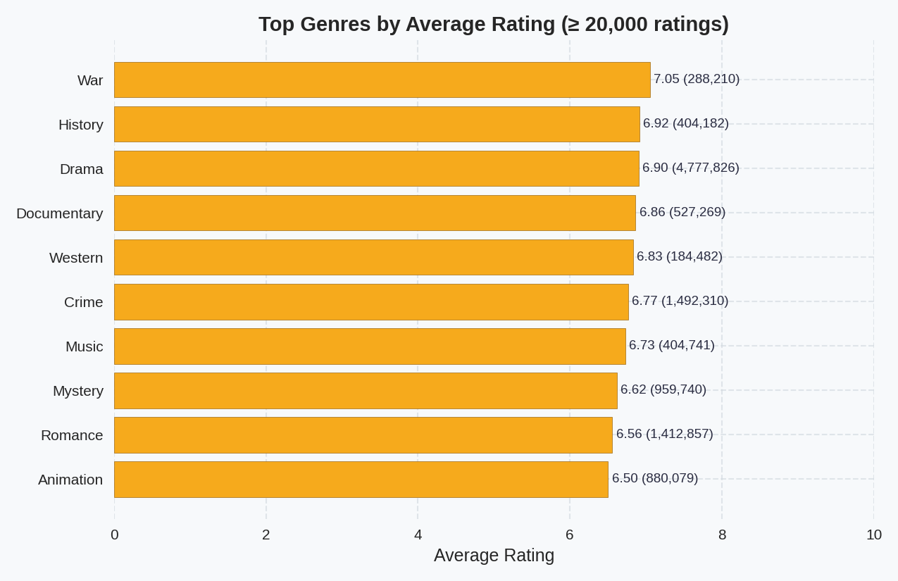

# Letterboxd Movie Ratings Analysis

Analyze the Letterboxd public dataset to understand how viewers rate films, which genres resonate most, and how engagement has evolved over time. The project showcases a reproducible Python pipeline that cleans the raw CSV exports, aggregates per-film metrics, and produces narrative-ready visuals and findings.



> _Note: Raw data files are not included in the repository. Obtain the Letterboxd dumps separately and place them in `data/` before running the pipeline._

## Project Highlights
- Cleans **11M+ user ratings** across **283K films** using Pandas-based scripts.
- Generates polished visualizations covering rating distributions, genre performance, release-year trends, and language insights.
- Summarizes key takeaways in `reports/findings_report.md` for quick portfolio sharing.

## Repository Structure
```
├── data/                # Raw CSVs (movies.csv, ratings.csv, users.csv) and processed outputs
├── reports/             # Generated analyses, charts, and the findings brief
├── scripts/             # Reusable Python scripts for each pipeline stage
├── requirements.txt     # Python dependencies
├── progress_plan.md     # Detailed roadmap and status log
└── README.md
```

## Quick Start
```bash
python -m venv venv
source venv/bin/activate            # Windows: venv\Scripts\activate
pip install --upgrade pip
pip install -r requirements.txt
```

Populate the `data/` directory with the Letterboxd CSV exports (`movies.csv`, `ratings.csv`, `users.csv`), then run one of the options below.

### Option 1 – Makefile (recommended)
```bash
make pipeline            # Runs the full cleaning → aggregation → analysis sequence
make visuals             # Regenerate only the visualization/report stage
```

### Option 2 – Manual Script Order
```bash
venv/bin/python scripts/load_data.py          # Optional: quick EDA sanity check
venv/bin/python scripts/clean_data.py
venv/bin/python scripts/aggregate_movies.py
venv/bin/python scripts/analyze_genres.py
```

All scripts are idempotent; rerunning them overwrites prior outputs in `reports/` and `data/processed/`.

## Key Outputs
- `reports/findings_report.md` – Executive summary of insights and next recommendations.
- `reports/rating_distribution.png` – Annotated histogram of user ratings (6–8 star cluster).
- `reports/top_genres_average_rating.png` – Weighted genre leaderboard with volume callouts.
- `reports/yearly_rating_trends.png` – Release-year volume vs. rolling-average sentiment.
- `reports/language_rating_volume.png` – Rating volume and averages by original language.
- `data/processed/` – CSV archives for processed tables and aggregations.

## Portfolio Notes
- Reference the "Project Highlights" and visuals above when showcasing results.
- `progress_plan.md` captures the evolution of the work and can guide talking points during interviews.
- Suggested follow-ups include user segmentation, TMDb/IMDb benchmarking, or turning the findings report into a blog post or slide deck.

## License & Credits
This analysis uses Letterboxd data released under their terms of service. Ensure you comply with the data source license when publishing results.
